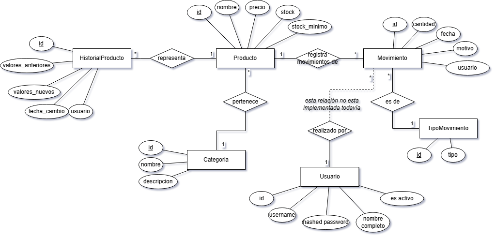

# Respuestas a la Evaluación Técnica - Desarrollador Junior Full Stack

Este documento contiene las justificaciones y respuestas conceptuales a las preguntas planteadas del ejercicio "Sistema de Gestión de Inventario".

---

## Parte 1: Base de Datos

### 1.1 Diseño del modelo

**¿Qué tipo de base de datos elegirías y por qué?**
* **Respuesta:**
    Elegí PostgreSQL porque es una base de datos relacional robusta que requiere transaccionalidad estricta, lo cual es beneficioso para un sistema de este estilo. Se tuvo en cuenta la posibilidad de trabajar con una base de datos no relacional como MongoDB, pero su ventaja en cuanto a la escalabilidad no era tan importante como la seguridad ACID que provee SQL.

**¿Usarías un ORM? ¿Qué ventajas y desventajas ves en este caso?**
* **Respuesta:**
    Sí, decidí utilizar SQLAlchemy. La principal ventaja es un desarrollo rápido, ya que no solamente ayuda con el armado y manejo de tablas en la base de datos, sino que también previene inyecciones SQL. La mayor desventaja de la utilización de un ORM es la posible ineficiencia de las queries, pero esto puede ser tratado manualmente. Si se desea tener más control sobre las consultas a la base de datos, entonces no optar por un ORM puede ser más factible.

**¿Cómo garantizarías que el stock no quede negativo?**
* **Respuesta:**
    Este tipo de restricciones debe tener múltiples capas de aplicación. En este caso se llevan adelante chequeos en el frontend, en el backend y por último en la base de datos, utilizando la funcionalidad de constraints de SQL.

**¿Cómo conviven estas herramientas dentro del stack tecnológico de un proyecto?**
* **Respuesta:**
    Para un proyecto como este donde se utiliza un ORM es muy útil la implementación de un sistema de migraciones, para poder gestionar de forma ordenada y segura los cambios en el esquema y datos de la base de datos a lo largo del ciclo de vida de la aplicación. Con esto se evitan errores humanos y se facilitan las colaboraciones en equipo.

### 1.2 Historial de cambios
**¿Cómo guardarías el valor anterior si se edita nombre o precio? ¿En la misma tabla o aparte?**
* **Respuesta:**
    Para evitar poblar la tabla de la entidad productos, utilizaría una tabla aparte. De esta forma, al consultar productos no es necesario trabajar con una tabla que contiene filas correspondientes a un historial. Se utilizó en esta aplicación una tabla llamada “historial_producto” que contiene los valores anteriores y nuevos al momento de realizar un cambio.

### 1.3 Para pensar (Escalabilidad)
* **Respuesta:**
    Teniendo en cuenta que se trata de una base de datos relacional, si el sistema escala y el inventario pasa a tener 500.000 productos, entonces van a ser necesarias tomar decisiones para hacer más eficientes las consultas a la base de datos. Para este caso, indexación de la base de datos y la utilización de una caché, como por ejemplo Redis, podría significar una mejora en el rendimiento.

---

## Parte 2: Backend

### 2.1 Decisiones de arquitectura
**¿Qué lenguaje y framework usarías? ¿Cómo organizarías el proyecto?**
* **Respuesta:**
    Personalmente tengo familiaridad con frameworks de Java, como por ejemplo Springboot. Aun así, decidí utilizar Python, viéndolo como una oportunidad para aprender un framework nuevo y al mismo tiempo facilitar el trabajo de quienes evalúen este trabajo.
    Decidí usar FastAPI debido a la escala del trabajo y el tiempo disponible. Se aplicó una estructura monolítica de capas, con routes (controladores), services (lógica de negocio), repositories (acceso a datos) y models(patrón DTO). Toda esta estructura facilita el desarrollo, la escalabilidad y el testeo.  

**¿Dónde y cómo configurarías las reglas de negocio?**
* **Respuesta:**
    Exclusivamente en la capa de Services. Ningún controlador ni repositorio debería aplicar reglas de negocio siguiendo este estilo arquitectónico. 

### 2.2 Deploy
**¿Cómo deployarías este sistema y manejarías las diferencias de entorno?**
* **Respuesta:**
    Opté por la utilización de Docker. Al dockerizar se facilita el despliegue y se puede separar la base de datos del servicio de gestión.
    Para gestionar de forma segura y escalable las diferencias entre entornos, me basaría en centralizar toda la configuración dependiente del entorno mediante Variables de Entorno. Al dockerizar, se garantiza la compatibilidad en distintos entornos de despliegue. Aplicar la metodología Twelve Factor asegura aplicar las mejores prácticas para el desarrollo y el despliegue.

### 2.3 Seguridad: roles, perfiles y contraseñas
**Manejo de roles, contraseñas y protección de endpoints:**
* **Respuesta:**
    Para esto es ideal implementar un modelo de acceso basado en roles. Para esto se implementó inicio de registro e inicio de sesión con hashing de contraseñas y JWT, protegiendo los endpoints mediante inyección de dependencia de FastAPI. Luego es cuestión de asociar roles con un usuario y limitar accesos dependiendo del rol (esto último no se implementó).

### 2.4 Logs del sistema
**¿Qué registrarías, dónde lo guardarías y diferencia con auditoría?**
* **Respuesta:**
    En primer lugar, la auditoría de negocio se guarda en la base de datos. Son datos que forman parte del dominio del negocio y van a ser accedidos por el cliente.
    Luego, logs técnicos como errores, warns y información salen por salida estándar y también se guardan en archivos de logs. Además, se implementó loki+grafana, esto permite el uso de dashboards de Grafana para la visualización de logs y diagnóstico. Existen otras alternativas a Grafana, lo importante es poder responder de forma rápida o anticipada a errores que pueda llegar a tener el sistema en producción.

### 2.5 endpoint a implementar
*   
    Se implementó el endpoint de productos “obtener_todos” que filtra por categoría. Además, esto se utilizó en la UI web.
---

## Parte 3: Frontend

### 3.1 Elección de tecnología
**¿React o Streamlit? ¿Por qué y qué se sacrifica?**
* **Respuesta:** 
    Elegí Streamlit priorizando velocidad para este MVP, aunque implica sacrificar control fino de UI que tendría con React. Sin embargo, en este sistema para escalar de forma correcta y eficiente, la tecnología correcta a largo plazo sería React, con un framework como Next.js.

### 3.2 Pantallas a diseñar
**Decisiones de UI/UX (Columnas, Alertas, Formularios):**
* **Respuesta:**
    * Se eligió mostrar un gráfico de barras para poder mostrar el stock general de cada categoría, esto permite comparar las distintas categorías entre sí y tener una vista general del inventario. Se incluye en la misma pantalla una alerta de productos cuyo stock está por debajo del umbral establecido, permitiendo ver qué productos son y a qué categoría pertenecen. Además, se muestran datos que pueden ser de utilidad como una tabla con datos de categorías, stock total y valor.
    Luego hay una vista de stock por categoría, mostrando un gráfico de barras y torta de los productos, para poder visualizar cantidad y proporciones. Se muestra también stock y valor de la categoría. Los productos cuyo stock esté por debajo del umbral se muestran en color rojo, pero se pueden implementar más avisos. Además, en esta pantalla debería estar disponible la opción de establecer el umbral de stock mínimo de un producto (esta última feature no se encuentra disponible todavía). Por último, la tabla con más detalle sobre cada uno de los productos.
    Sobre el formulario para registrar un movimiento, la idea es permitir el input de los valores necesarios para poder hacer el movimiento, sin permitir el ingreso de valores inválidos. En este caso se optó por una pantalla para registrar los movimientos, pero podría estar incluido en la pantalla de productos por categoría, seleccionando un producto y registrando un movimiento.
    Es importante realizar un análisis extensivo de la experiencia de usuario a la hora de diseñar, antes y durante el desarrollo. En este caso, la UX podría ser mejorada sustancialmente, por ejemplo, conectando mejor las pantallas (la alerta te lleva a ver el stock del producto y permite hacer un movimiento).

## Parte 4: Git
*   
    Se utilizó Git para gestionar el versionado. El sistema se encuentra en un repositorio de GitHub. Se siguió un flujo Gitflow, con ramas feature que parten de la rama develop, que luego se trasladan a master. De ser necesario un hotfix este surge de master y se traslada al master y a develop.

## Parte 5: Uso de IA
*   
    Hice uso de Gemini para consultas del tipo teóricas, repaso de tecnologías, análisis de alternativas y evacuación de dudas. La elección solamente se debe a contar con el modelo Pro de Gemini por ser estudiante.
    Además, utilice Copilot Pro en VSCode como asistente a la hora de desarrollar. Una vez que pude establecer una estructura importante del código, el agente de copilot empezó a ser más útil para arreglar errores.
    Intenté utilizar IA para rápido desarrollo del frontend requerido, pero utilizando Next.js. Decidí no utilizarlo porque no tenía la robustez que buscaba y tampoco era claro en su estructura.
    Además de esto, siempre hay cosas que se sugieren y se descartan. Como por ejemplo endpoints que no se necesitaban. 
